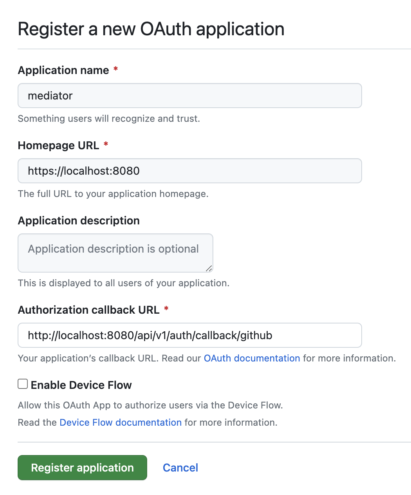

Continuous integration | License 
 ----------------------|---------
 [](https://github.com/stacklok/mediator/actions/workflows/main.yml) | [](https://opensource.org/licenses/Apache-2.0)

# Mediator

Mediator is a platform to secure the software supply chain.

# API

The API is defined [here](https://github.com/stacklok/mediator/blob/main/proto/v1/mediator.proto).

It can be accessed over gRPC or HTTP using [gprc-gateway](https://grpc-ecosystem.github.io/grpc-gateway/).

## How to generate protobuf stubs

We use [buf](https://buf.build/docs/) to generate the gRPC / HTTP stubs (both protobuf and openAPI). 

To build the stubs, run:

```bash
buf generate
```

Should you introduce a new language, update the `buf.gen.yaml` file

New dependencies can be added to the `buf.yaml` file as follows:

```bash
version: v1
name: buf.build/stacklok/mediator
deps:
  - buf.build/googleapis/googleapis
  - buf.build/path/to/dependency
```

```bash
buf mod update
```

# Configure OAuth2

Mediator can use OAuth2 to authenticate users, support for Google and GitHub is
currently implemented.

To enable OAuth2, you need to configure accounts in the relevant provider.

## Configure GitHub OAuth2

To configure GitHub OAuth2, you need to create a new OAuth2 application in your
GitHub account. 

Head to the [GitHub OAuth2 applications page](https://github.com/settings/applications/new)

Give your application a name and set the homepage URL to `http://localhost:8080`.

The callback URL should be set to:

`http://localhost:8080/api/v1/auth/callback/github`.



On the next page, you will see your client ID and you can generate a client secret.

Place these values in the `config.yaml` file:

```bash
github:
  client_id: "client_id"
  client_secret: "client_secret"
  redirect_uri: "http://localhost:8080/api/v1/auth/callback/github"
```

## Configure Google OAuth2

To configure Google OAuth2, you need to create a new OAuth2 application in your
Google account. 

Follow the official [Google OAuth2 documentation](https://developers.google.com/identity/protocols/oauth2/web-server#creatingcred).

The callback URL should be set to:

`http://localhost:8080/api/v1/auth/callback/google`.

Place these values in the `config.yaml` file:

```bash
github:
  client_id: "client_id"
  client_secret: "client_secret"
  redirect_uri: "http://localhost:8080/api/v1/auth/callback/google"
```
