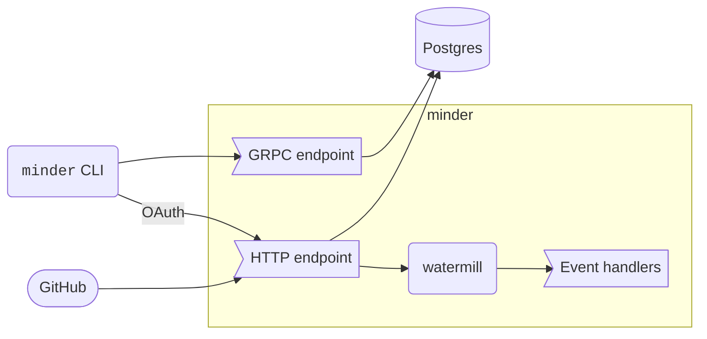

# System Architecture

While it is built as a single container, Minder implements several external
interfaces for different components. In addition to the GRPC and HTTP service
ports, it also leverages the [watermill library](https://watermill.io) to queue
and route events within the application.

The following is a high-level diagram of the Minder architecture

