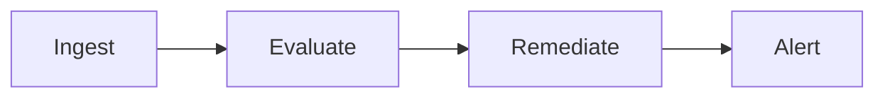
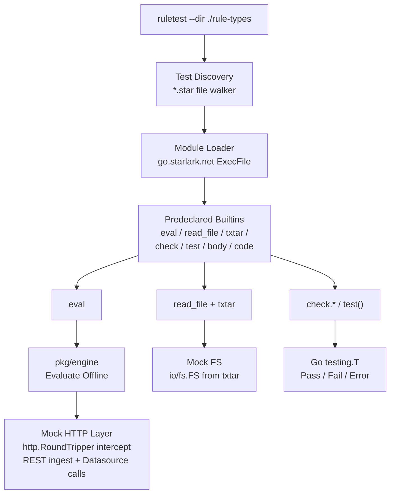
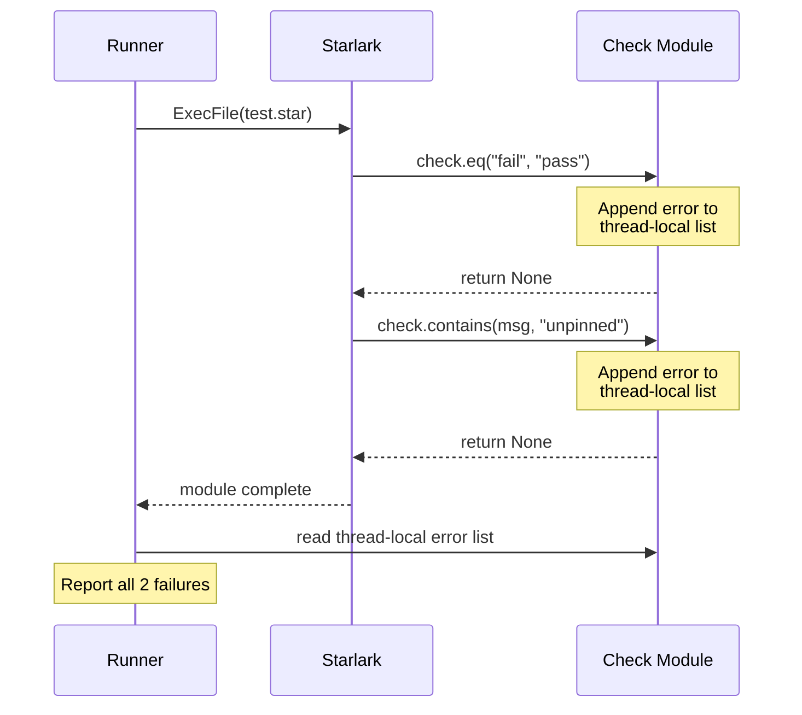

# Minder Rule Testing Framework -- Design

**Author:** Krrish Biswas
**Mentor:** Evan Anderson
**Status:** Draft
**Related issue:**
[#6434](https://github.com/mindersec/minder/issues/6434)

---

## Abstract

There is currently no standardized way to test Minder rules outside
of a live environment. This document proposes a rule testing framework
built on [Starlark](https://github.com/google/starlark-go) embedded
in Go, using mocked HTTP responses and inline file fixtures to allow
offline rule verification.

---

## Background

### How Minder rules work

A Minder rule type defines a security policy check for an entity
(repository, artifact, pull request). Each rule has four phases:



**Ingest** fetches data from an external source via the configured
provider. Two ingest types exist:

| Type | Mechanism | Example |
|---|---|---|
| `rest` | HTTP GET to provider API | Branch protection settings |
| `git` | Clone repo, expose `file.ls()` / `file.read()` | GitHub Actions workflows |

The provider determines which API surface is used. For a GitHub
provider, `rest` calls the GitHub API; for a GitLab provider, it
calls the GitLab API; and so on.

**Evaluate** runs either a `jq` expression (simple field comparison)
or a `Rego/OPA` policy against the ingested data. During evaluation,
rules may also call **datasources** -- named HTTP clients declared
separately from the rule. When Rego calls
`minder.datasource.baselineghapi.branch_protection_status({...})`,
the datasource fetches from a real API endpoint defined in a
datasource YAML. Responses are returned to Rego wrapped in
`{"body": <payload>, "status": 200}`. See the
[datasource documentation](https://docs.mindersec.dev/understand/data_sources)
for more details.

**Remediate** applies an automated fix when a rule evaluation fails
(for example, opening a PR to pin an unpinned action). **Alert**
sends a notification about the evaluation result. Both are out of
scope for v1 of the testing framework.

### Prior art

Two existing tools partially address rule testing:

**`mindev rtst`** runs a single rule evaluation against live
providers with a manually-specified entity. It requires a full
profile definition, rule definition, and live credentials for the
provider. The dependency on live credentials and backend services
makes it unsuitable for automated testing.

**`rules_test.go`** from
[minder-rules-and-profiles](https://github.com/mindersec/minder-rules-and-profiles)
runs against test data and supports batch operation, but has several
limitations. The framework does not support datasources and is
verbose when testing multiple cases. Additionally, file test data
representing vulnerabilities appears "live" to tools like dependabot
or trivy, and it is difficult to reuse the tool outside that
particular repo. Finally, having a standalone binary in a different
repository introduces dependency churn management that would not
be required if it were an official binary in the main repo.

Given that `rules_test.go` is approximately 300 lines, it is
reasonable to rewrite the functionality rather than attempt to extend
it.

### Related repositories

- `mindersec/minder` -- core server, `pkg/engine`,
  `internal/datasources`
- `mindersec/minder-rules-and-profiles` -- rule type YAML files
  and profiles

---

## Goals and Non-Goals

### Goals

- Allow rule authors to run rule tests **locally**, with no network
  access and no credentials
- Support both ingest types (REST and git) and datasources
- Integrate with Go's `testing` package for standard test output
  and CI reporting
- Make simple tests trivially easy to write (single-function test
  cases under 20 lines)
- Make hard tests possible (multi-source mocking, parameterized
  fixtures)
- **Auto-discover** test files in a directory tree without manual
  test registration

### Non-Goals (v1)

- Remediation output testing (verifying auto-fix PR content)
- Alert output testing
- Testing Rego `error()` abort behavior
- Timeout simulation

---

## Overview



The test runner walks a directory tree, finds all `*.star` files,
and executes each using an embedded Starlark interpreter. A set of
predeclared Go builtins (`eval`, `read_file`, `txtar`, `check`,
`test`) are injected into each module's environment. The builtins
delegate to the existing `pkg/engine` evaluation pipeline, with
HTTP and Git filesystem calls intercepted by a mock layer.

Starlark's `load()` statement allows one `*.star` file to import
another, enabling shared libraries of helper functions and check
utilities across tests.

---

## Detailed Design

### DD1: Test File Format -- Starlark

After prototyping three formats (Hybrid DSL, txtar+TOML, Starlark),
Starlark is selected as the test file format. See
[Alternatives Considered](#alternatives-considered) for the
comparison.

Using a real programming language provides benefits such as
parameterized fixtures, shared helpers, and composable defaults
without the need to invent a custom templating syntax.

**Wrapper functions replace `[defaults]` blocks:**

```python
# Default arguments carry shared setup.
# Tests only specify what varies.
def workflow_rule(ref, files="check_pinned.txtar",
                  entity=DEFAULT_ENTITY):
    fs = {}
    if files != None:
        fs = {k: v.format(ref=ref)
              for k, v in txtar(read_file(files)).items()}
    return eval(
        rule   = "actions_check_pinned_tags",
        entity = entity,
        files  = fs,
    )

# One template txtar, two test variants.
def test_pinned():
    check.eq(workflow_rule(PINNED_SHA).status, "pass")

def test_floating():
    check.eq(workflow_rule("v4").status, "fail")
```

#### txtar as file-bundling layer

The txtar format is used alongside Starlark as a file-bundling
mechanism for git-ingest test fixtures:

```text
-- .github/workflows/ci.yml --
name: CI
on: [push]
jobs:
  build:
    steps:
      - uses: actions/checkout@{ref}
```

The `{ref}` placeholder is substituted via Starlark's `.format()`,
enabling parameterized git fixture files without duplicating
workflow content per test case.

---

### DD2: Datasource Mocking -- HTTP-Level Interception

Datasource mocking is the most significant design decision in the
framework. The chosen approach mocks at the **HTTP boundary**. The
datasource definition is loaded, and its HTTP calls are intercepted
by a custom `http.RoundTripper`. Rule authors write mocks against
real provider API shapes:

```python
# Test: classic branch protection blocks force pushes
mocks = {
    "GET https://api.github.com/repos/acme-corp/widgets"
    "/branches/main/protection":
        body({"allow_force_pushes": {"enabled": False}}),
    "GET https://api.github.com/repos/acme-corp/widgets"
    "/rules/branches/main":
        body([{"ruleset_source_type": "Repository",
               "type": "non_fast_forward"}]),
}
```

```python
# Test: branch not protected
# (different mock for same endpoint)
mocks = {
    "GET https://api.github.com/repos/acme-corp/widgets"
    "/branches/main/protection":
        code(404),
}
```

`body(payload)` and `code(status)` are Go-supplied Starlark builtins:

- `body(x)` -- returns a 200 response with payload `x`
- `code(n)` -- returns an empty response with HTTP status `n`

**Advantages:**

- The datasource definition is loaded and exercised, catching bugs
  in endpoint URLs or field mappings.
- Authors can go directly from provider API docs to test mocks
  without knowledge of datasource internals.
- The `{"body"/"status"}` wrapper is applied by the datasource as
  in production, so authors do not need to think about it.
- Both datasource calls and ingest fetches use the same consistent
  mocking mechanism.

**URL matching:** Mock URLs support glob patterns for path
parameters (e.g. `repos/*/branches/*`), allowing a single mock to
match multiple entity-specific paths.

#### Datasource discovery

Datasource definitions are declared explicitly in the test file.
This avoids implicit magic and makes each test self-contained:

```python
result = eval(
    rule = "branch_protection_allow_force_pushes",
    entity = DEFAULT_ENTITY,
    datasources = ["path/to/baselineghapi.yaml"],
    mocks = {
        "GET https://api.github.com/repos/*/branches/*/protection":
            body({"allow_force_pushes": {"enabled": False}}),
    },
)
```

See [Alternatives Considered](#a4-datasource-abstract-box-mocking)
for the rejected approach of mocking datasource outputs directly.

---

### DD3: Test Discovery and File Layout

Test files are co-located alongside rule YAML files in the same
directory:

```text
rule-types/github/
+-- branch_protection_allow_force_pushes.yaml
+-- branch_protection_allow_force_pushes.star
+-- osps-ac-03-01.yaml
+-- osps-ac-03-01.star
```

With `*.star` as a suffix, globs can easily distinguish test files
from rule definitions (`*.yaml`).

#### Discovery

```bash
ruletest --dir ./rule-types
```

Recursive walk finds all `*.star` files. The directory path acts
as the implicit test suite without explicit suite configuration.

**Rule loading:** The test runner loads all `*.yaml` files in the
same directory as the `*.star` file, then filters by the name
passed to `eval(rule="name")`. Duplicate rule names in the same
directory are detected and generate an error.

---

### DD4: Test Case Declaration

The framework uses `test_*` function discovery. After Starlark
module execution, the runner scans module globals for no-argument
callables whose names start with `test_`. The function name becomes
the test identifier, mirroring the conventions of pytest and Go's
`TestXxx`.

```python
def test_force_pushes_disabled():
    result = eval(
        rule = "branch_protection_allow_force_pushes",
        entity = DEFAULT_ENTITY,
        mocks = {ENDPOINT: body({
            "allow_force_pushes": {"enabled": False},
        })},
    )
    check.eq(result.status, "pass")

def test_force_pushes_enabled():
    result = eval(
        rule = "branch_protection_allow_force_pushes",
        entity = DEFAULT_ENTITY,
        mocks = {ENDPOINT: body({
            "allow_force_pushes": {"enabled": True},
        })},
    )
    check.eq(result.status, "fail")
```

This approach requires scanning `starlark.StringDict` globals after
`ExecFile` and invoking matching functions. The `go.starlark.net`
library provides `starlark.Call()` for this, making implementation
straightforward.

#### Table-driven tests

For parameterized tests, a helper function combined with a list of
test case objects provides the equivalent of Go's table-driven test
pattern:

```python
cases = [
    {"name": "pinned",   "ref": PINNED_SHA,   "expect": "pass"},
    {"name": "floating", "ref": FLOATING_TAG, "expect": "fail"},
]

def test_workflow_refs():
    for case in cases:
        result = eval(
            rule = "actions_check_pinned_tags",
            entity = DEFAULT_ENTITY,
            files = workflow_files(case["ref"]),
        )
        check.eq(result.status, case["expect"],
                 label=case["name"])
```

---

### DD5: Assertions -- Expect Semantics

The `check` module uses **expect semantics** rather than assert
semantics. Per the
[Google Testing Blog](https://testing.googleblog.com/2008/07/tott-expect-vs-assert.html):

| Style | Behavior | Effect |
|---|---|---|
| **Assert** | Stops test on first failure | You see only the first error |
| **Expect** | Collects all failures, reports at end | You see all errors at once |

For a rule test framework, expect semantics are preferable. A test
with multiple `check.*` calls reports all failures rather than
stopping at the first:

```python
check.eq(result.status, "pass")
check.eq(len(result.violations), 1)
check.contains(result.violations[0].msg, "unpinned")
```

All failures are collected and reported together when the test
function returns.

**Implementation:** The `check` module maintains a thread-local
error list via `starlark.Thread` local storage. At test completion,
the runner reads this list and reports all collected failures via
Go's `testing.T`.

#### Shared check helpers via `load()`

Higher-level check helpers are defined as a Starlark module that
tests import using Starlark's
[`load()` statement](https://starlark-lang.org/spec.html#load-statements):

```python
# checks.star (shipped with ruletest)
def violations_count(result, n):
    check.eq(len(result.violations), n)

def violation_contains(result, msg):
    found = False
    for v in result.violations:
        if msg in v.msg:
            found = True
    check.eq(found, True)
```

```python
# In a test file:
load("checks.star", "violations_count", "violation_contains")

def test_unpinned_action():
    result = eval(...)
    violations_count(result, 1)
    violation_contains(result, "unpinned")
```

This means new check helpers can be added without Go changes. The
core Go builtins stay minimal (`check.eq`, `check.ne`,
`check.contains`); the Starlark `load()` mechanism provides
extensibility.

---

### DD6: Predeclared Builtins

The following Go-implemented builtins are injected into each
Starlark module's predeclared environment:

| Builtin | Signature | Description |
|---|---|---|
| `eval` | `eval(rule, entity, mocks?, files?, datasources?)` | Evaluate a rule against the given entity and mocks. Returns an `EvalResult` with `.status` and `.violations`. |
| `read_file` | `read_file(path)` | Read a file relative to the test file's directory. Rejects absolute paths and `..` traversal. |
| `txtar` | `txtar(string)` | Parse a txtar-formatted string into a `dict[filename -> content]`. Pure string parsing, no I/O. |
| `check` | `check.eq(got, want)`, `check.ne(got, want)`, `check.contains(haystack, needle)` | Expect-style assertions. Failures are collected, not thrown. |
| `body` | `body(payload)` | Create a mock HTTP response with status 200 and the given payload. |
| `code` | `code(status)` | Create a mock HTTP response with the given status code and empty body. |

The `read_file` builtin uses `io/fs.FS` rooted at the test file's
directory for sandboxing, the same abstraction already used by
Minder's go-billy git client.

---

### DD7: Error Propagation



`eval()` errors (e.g. unmocked HTTP call, unknown rule name) return
Go `error`, which surfaces as a Starlark exception and stops the
current function. This is appropriate because a broken test setup
should fail immediately rather than silently continue with invalid
state.

---

## Alternatives Considered

### A1: Hybrid DSL (`when/then` format)

```text
test "force_pushes_disabled":
  when:
    github_rest GET /repos/.../protection:
      status: 200
      body:
        allow_force_pushes:
          enabled: false
  then:
    result: pass
```

- **Pros:** Readable for non-programmers. Clear visual separation
  of inputs and assertions.
- **Cons:** Requires custom tokenizer and BNF grammar. No
  parameterization or loops. No sharing of test setup across cases.
  Every check variant requires a grammar change.

### A2: txtar + TOML

```toml
[[test]]
name = "force_pushes_disabled"
mock.method = "GET"
mock.path = "/repos/.../branches/main/protection"
mock.status = 200
mock.body.allow_force_pushes.enabled = false
expect.result = "pass"
```

- **Pros:** Standard parsers exist (`BurntSushi/toml`).
  `[[array.of.tables]]` gives clear test boundaries. TOML
  dotted-key notation is clean for shallow data.
- **Cons:** `[[array.of.tables]]` nesting becomes hard to follow
  when a test case has multiple mock sources. No parameterization.
  Mock data and test definition are in the same file, coupling data
  with logic.

txtar remains useful as a **file-bundling layer** alongside Starlark
for git-ingest test fixtures.

### A3: Alternative embedded language

- **Python:** Familiar but heavy dependency. Non-trivial to sandbox.
- **Lua:** Lightweight but niche. Unfamiliar to most contributors.
- **JavaScript/Node:** Familiar but significant runtime complexity.
- **Starlark (chosen):** Designed for embedding in Go tools.
  Deterministic (no I/O, no randomness by default).
  `go.starlark.net` is mature (used by Bazel). Python-like syntax.
  Sandboxable.

### A4: Datasource abstract box mocking

Instead of HTTP-level mocking (DD2), this approach mocks the
*output* of the datasource call directly, bypassing the datasource
definition:

```python
mocks = {
    "datasource:baselineghapi/branch_protection_status": {
        "body": {"applied_rulesets": [
            {"type": "non_fast_forward"},
        ]},
    },
}
```

- **Advantage:** Simple to write. No knowledge of the underlying
  API shape needed.
- **Disadvantage:** The datasource definition is never exercised.
  If the datasource has a bug (wrong endpoint, wrong field mapping),
  tests still pass. Authors also need to know the datasource's
  output shape, including the `{"body"/"status"}` wrapper.

Rejected in favor of HTTP-level mocking, which exercises the full
datasource pipeline and aligns test mocks with provider API
documentation.

### A5: Subdirectory for test files

Instead of co-locating `*.star` files next to `*.yaml` files (DD3),
test files could live in a `tests/` subdirectory:

```text
rule-types/github/
+-- branch_protection_allow_force_pushes.yaml
+-- osps-ac-03-01.yaml
+-- tests/
    +-- branch_protection_allow_force_pushes.star
    +-- osps-ac-03-01.star
```

- **Advantage:** Clear separation between rule definitions and test
  code.
- **Disadvantage:** Adding a test requires navigating to a different
  directory; rule and test are farther apart.

Rejected because co-location makes it immediately visible whether
a rule has a test, and the `*.star` suffix provides sufficient
distinction from `*.yaml` files.

### A6: Alternative test declaration approaches

Three other test declaration approaches were considered alongside
`test_*` function discovery (DD4):

**`test()` builtin with `expect`:**

```python
test("force pushes disabled",
     "branch_protection_allow_force_pushes",
     mocks = {ENDPOINT: body({...})},
     entity = DEFAULT_ENTITY,
     expect = "pass")
```

Simple for pass/fail but does not support complex assertions like
checking violation messages.

**`test()` with `(label, got, want)` tuples:**

```python
result = eval("no_open_security_advisories",
              entity=DEFAULT, mocks={"/*": code(404)})

test("security advisories off", [
    ("status",      result.status,          "fail"),
    ("viol. count", len(result.violations), 1),
])
```

Good diagnostic output but more verbose for simple tests.

**`cases` dict + comprehension:**

Compact for parameterized tests but less structured. The `test_*`
function approach combined with list-of-objects table-driven tests
(see DD4) provides equivalent functionality with a more familiar
API.
