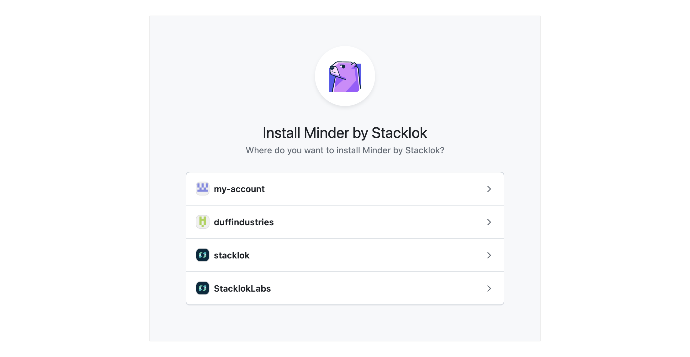
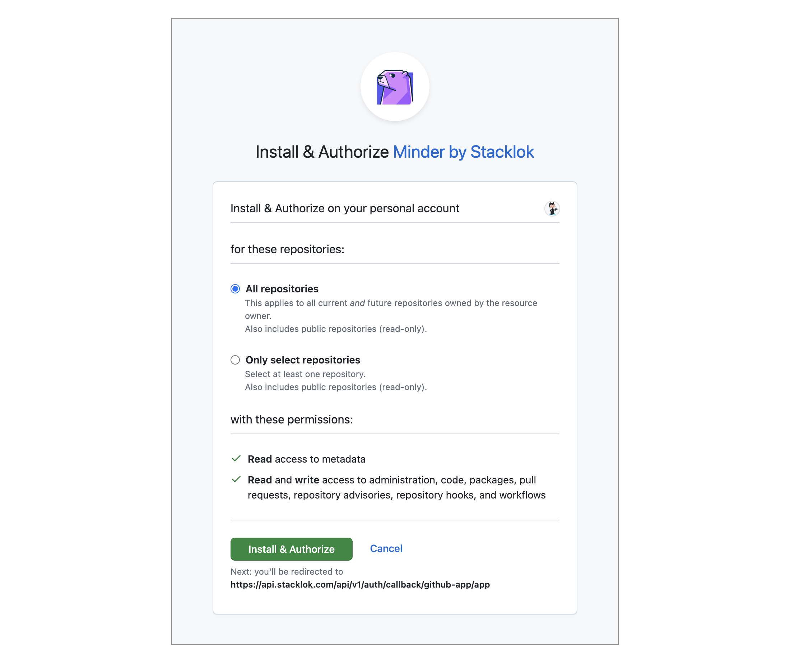

# Enrolling the GitHub Provider

Once you have authenticated to Minder, you'll need to enroll your GitHub credentials to allow Minder to manage your GitHub repositories. This allows Minder to inspect and manage your repository configuration. You will be prompted to grant Minder access.

In the future, Minder will support other source control and artifact repositories, and you will be able to enroll credentials for those providers in the same manner.

:::note
If you used the [minder `quickstart` command](quickstart), the GitHub Provider was enrolled as part of the quickstart, and you do not need to enroll a second time.
:::

## Prerequisites

Before you can enroll the GitHub Provider, you must [log in to Minder using the CLI](login).

## Enrolling and granting access

To enroll your GitHub credentials in your Minder account, run:

```bash
minder provider enroll
```

A browser session will open. If you are a member of multiple GitHub organizations, then you will be prompted which organization you want to enroll. You can select your personal account, or a GitHub organization that contains the repositories that you want to manage with Minder.



Then you will need to select which repositories you want to allow Minder to manage. You can select all repositories within your GitHub organization, or you can choose individual repositories. If you select individual repositories, they will not be visible within Minder, and you will not be able to [register them](register_repos).



You can change your repository selection within GitHub at any time.

Once you authorize Minder within GitHub, the browser window will close, and you will have enrolled the GitHub Provider. The `minder` CLI application will report the session is complete.
