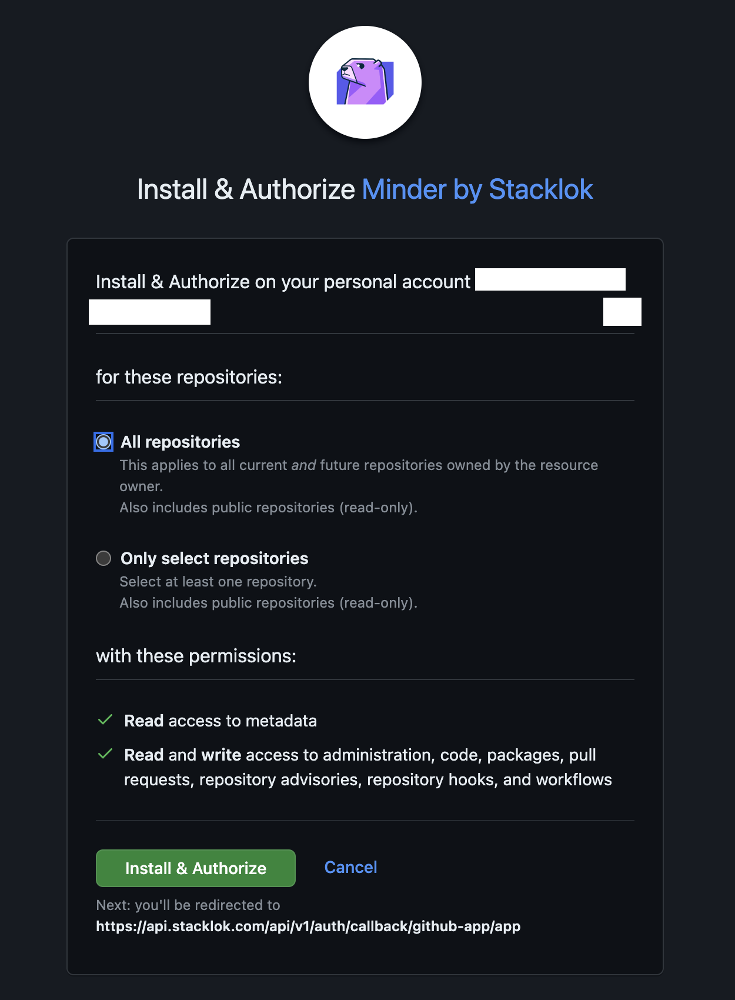

# Enrolling a Provider

Once you have authenticated to Minder, you'll want to enroll your GitHub credentials to allow Minder to manage your GitHub repositories.  In the future, Minder will support other source control and artifact repositories, and you will be able to enroll credentials for those providers in the same manner.

## Prerequisites

* A running Minder server, including a running KeyCloak installation
* A GitHub account
* [The `minder` CLI application](./install_cli.md)
* [Logged in to Minder server](./login.md)

## Enrolling the GitHub Provider

To enroll your GitHub credentials in your Minder account, run:

```bash
minder provider enroll
```

A browser session will open, and you will be prompted to login to your authorize the Minder application to access your GitHub account and select the organizations you want to install the application for.




Once you have granted Minder access, you will be redirected back, and the user will be enrolled. The `minder` CLI application will report the session is complete.