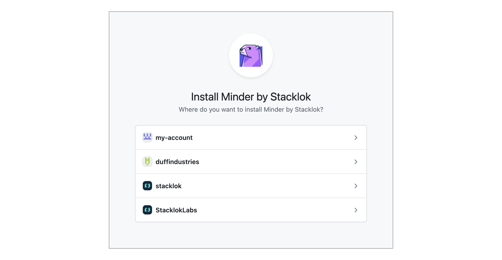
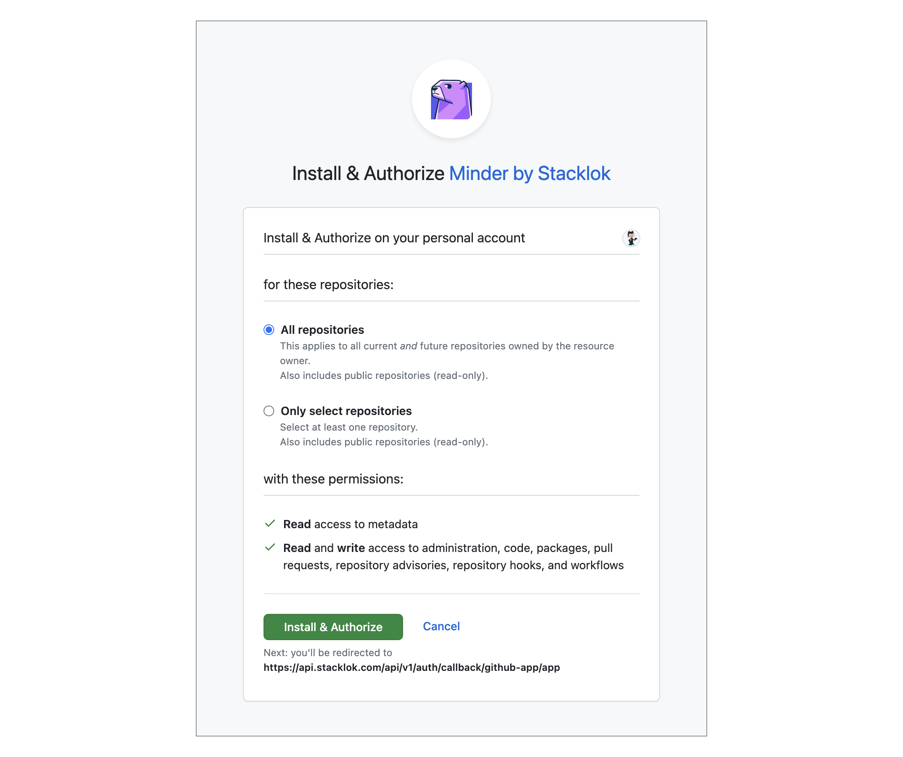

import Tabs from '@theme/Tabs';
import TabItem from '@theme/TabItem';

Once you have authenticated to Minder, you'll need to enroll your provider
credentials to allow Minder to manage your repositories. This allows Minder
to inspect and manage your repository configuration. You will be prompted to
grant Minder access.

## Prerequisites

Before you can enroll a provider, you must
[log in to Minder using the CLI](login).

## Enrolling and granting access

<Tabs>
<TabItem value="github" label="GitHub" default>

:::note
If you used the [minder `quickstart` command](quickstart), the GitHub provider
was enrolled as part of the quickstart, and you do not need to enroll a second
time.
:::

To enroll your GitHub credentials in your Minder account, run:

```bash
minder provider enroll
```

A browser session will open. If you are a member of multiple GitHub
organizations, then you will be prompted which organization you want to enroll.
You can select your personal account, or a GitHub organization that contains the
repositories that you want to manage with Minder.



Then you will need to select which repositories you want to allow Minder to
manage. You can select all repositories within your GitHub organization, or you
can choose individual repositories. If you select individual repositories, they
will not be visible within Minder, and you will not be able to
[register them](register_repos).



You can change your repository selection within GitHub at any time.

Once you authorize Minder within GitHub, the browser window will close, and you
will have enrolled the GitHub provider. The `minder` CLI application will report
the session is complete.

</TabItem>
<TabItem value="gitlab" label="GitLab">

This guide uses the OAuth flow, which is the quickest way to get started.
Note that OAuth has some tradeoffs: Minder acts as the authorizing user (which
can make merge requests and attribution confusing), access is hard to scope
when the user belongs to multiple projects, and enrollment breaks if that
user ever leaves the project. For production use with multiple administrators,
a dedicated [service account with a Personal Access Token](../integrations/provider_integrations/gitlab#authorization-methods)
is recommended instead.

To enroll your GitLab credentials in your Minder account, run:

```bash
minder provider enroll --class gitlab
```

A browser session will open, directing you to GitLab's authorization page.
Unlike GitHub, there is no organization or group selection step — GitLab
grants access based on the scopes configured in the OAuth application
(`api`, `read_user`, and `read_repository`).

Once you authorize Minder within GitLab, the browser window will close, and
the `minder` CLI will report:

```bash
Provider enrolled successfully
```

</TabItem>
</Tabs>

## More information

Once enrolled, you can [register your repositories](register_repos) with
Minder.
