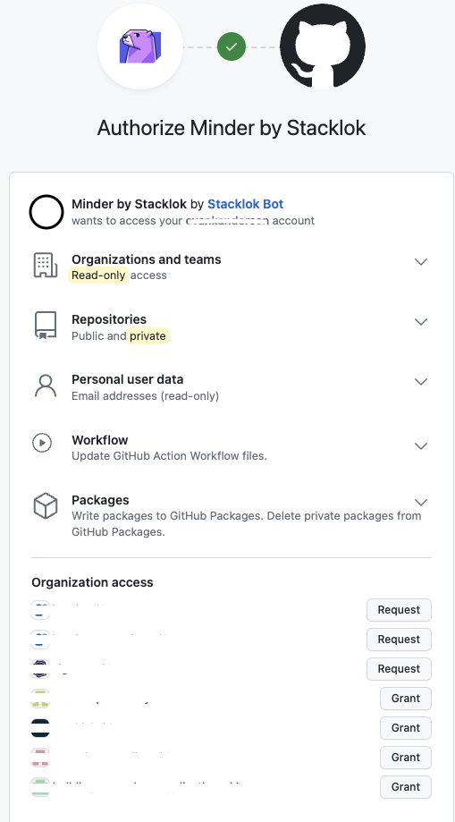

# Logging in and Enrolling a Provider

Minder consists of a client-side CLI tool and a server-side component.  The server-side component runs as a multi-user service.  In order to use Minder to manage repositories and artifacts, you need to log in, which will automatically create an account.

## Prerequisites

* [The `minder` CLI application](./install_cli.md)
* A running Minder server, including a running KeyCloak installation

If you don't want to run your own Minder server, Stacklok hosts a public instance.  See [Logging in to the Stacklok-hosted Instance](#logging-in-to-the-stacklok-hosted-instance) below.

## Logging in to your own Minder instance

To log in to a Minder server which you are running (self-hosted), you will need to know the URL of the Minder server and of the Keycloak instance used for authentication.  If you are using [`docker-compose` to run Minder on your local machine](../run_minder_server/run_the_server.md), these addresses will be `localhost:8090` for Minder and `localhost:8081` for Keycloak.

You can log in to Minder using:

```bash
minder auth login --grpc-host localhost --grpc-port 8090 --identity-url http://localhost:8081
```

Your web browser will be opened to log in to Keycloak, and then a banner  will be printed an

```
    You have successfully logged in.
 
 Here are your details: 

┌────────────────────────────────────────────────┐
│ Key                    Value                   │
│ Project Name           KeyCloak-username       │
│ Minder Server          localhost:8090          │
└────────────────────────────────────────────────┘
Your access credentials have been saved to ~/.config/minder/credentials.json
```

Once you have logged in, you'll want to [enroll your GitHub credentials in Minder so that it can act on your behalf](#enrolling-the-github-provider).

## Logging in to the Stacklok-hosted instance

The `minder` CLI defaults to using the hosted Stacklok environment.  When using the hosted environment, you do not need to set up a server; you simply log in to the Stacklok authentication instance using your GitHub credentials.

You can use the Stacklok hosted environment by running:

```bash
minder auth login
```

A new browser window will open and you will be prompted to log in to the Stacklok instance using your GitHub credentials.  Once you have logged in, proceed to enroll your credentials in Minder.

## Enrolling the GitHub Provider

Once you have authenticated to Minder, you'll want to enroll your GitHub credentials to allow Minder to manage your GitHub repositories.  In the future, Minder will support other source control and artifact repositories, and you will be able to enroll credentials for those providers in the same manner.

To enroll your GitHub credentials in your Minder account, run:

```bash
minder provider enroll --provider github
```

A browser session will open, and you will be prompted to login to your GitHub account.



Once you have granted Minder access, you will be redirected back, and the user will be enrolled. The `minder` CLI application will report the session is complete.

When enrolling an organization, use the `--owner` flag of the `minder provider enroll` command to specify the organization name:
```bash
minder provider enroll --provider github --owner test-org
```
The `--owner` flag is not required when enrolling repositories from your personal account.

Note: If you are enrolling an organization, the account you use to enroll must be an Owner in the organization
or an Admin on the repositories you will be registering.