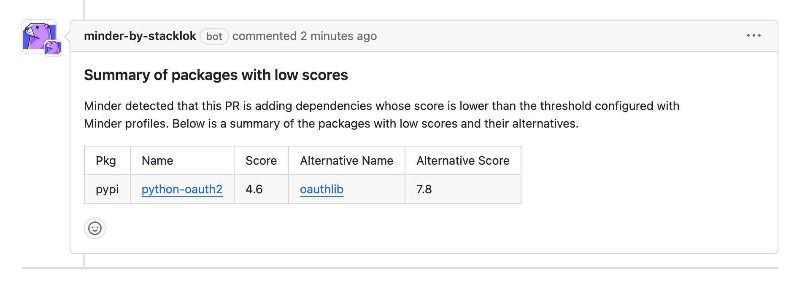

# Trusty Integration

Minder integrates directly with [Trusty by Stacklok](http://trustypkg.dev) to enable policy-driven dependency management based on the risk level of dependencies.

Minder provides a [Trusty rule type](../ref/rules/pr_trusty_check.md) which allows you to monitor new pull requests for newly added dependencies with low [Trusty](https://www.trustypkg.dev/) scores.

For every pull request submitted to a repository, this rule will check if the pull request adds a new dependency with
a Trusty score below a threshold that you define. If a dependency with a low score is added, Minder will notify you and 
suggest an alternative package, if one is available.

Here we see Minder in action, commenting on a pull request that adds a package with a low Trusty score:



## Create the rule type

Once you have [a Minder account](../getting_started/login.md), you can create a new rule of type `pr_trusty_check` to monitor your pull requests for untrustworthy packages.

The rule type is one of the reference rule types provided by the Minder team.

Fetch all the reference rules by cloning the [minder-rules-and-profiles repository](https://github.com/stacklok/minder-rules-and-profiles).

```bash
git clone https://github.com/stacklok/minder-rules-and-profiles.git
```

In that directory, you can find all the reference rules and profiles.

```bash
cd minder-rules-and-profiles
```

Create the `pr_trusty_check` rule type in Minder:

```bash
minder ruletype create -f rule-types/github/pr_trusty_check.yaml
```

## Create a profile

Next, create a profile that applies the rule to all registered repositories.

Create a new file called `low-trusty-score-profile.yaml`. In this profile the following options are configured: 
- `action` is set to `summary` allowing Minder to comment on pull requests with a low Trusty score, providing an explanation of the issue and possible alternatives.
- `ecosystem_config` is set to check the `pypi` ecosystem for new dependencies whose Trusty score is below the threshold of 5.

```yaml
---
version: v1
type: profile
name: low-trusty-score-profile
context:
  provider: github
remediate: "on"
pull_request:
  - type: pr_trusty_check
    def:
      action: summary
      ecosystem_config:
        - name: pypi
          score: 5
```

Create the profile in Minder:

```bash
minder profile create -f low-trusty-score-profile.yaml
```

That's it! Any registered repos will now be monitored for new dependencies with low Trusty scores.
