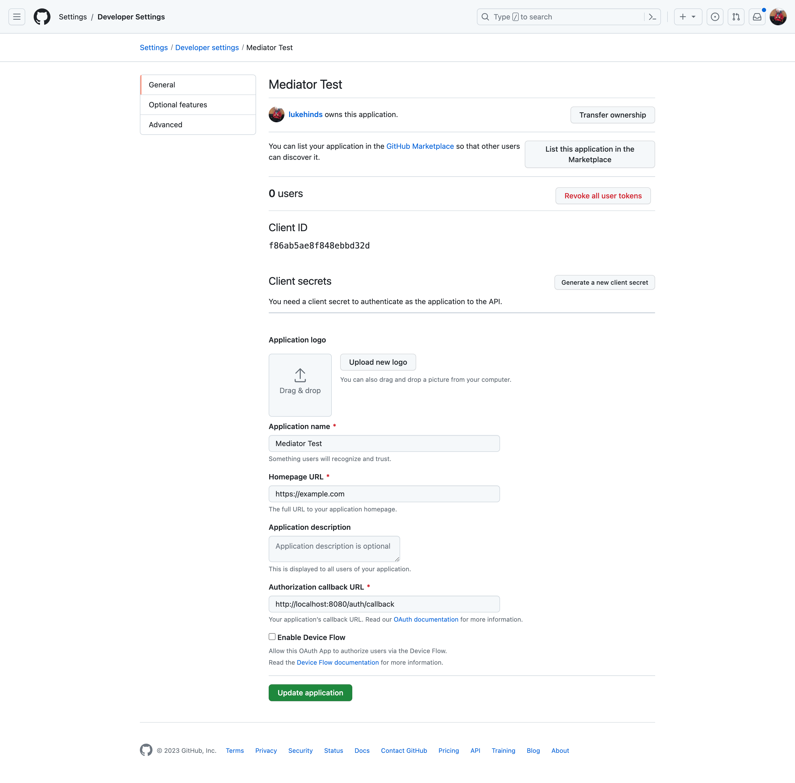

# Run a mediator server

Mediator is platform, comprising of a controlplane, a CLI, a database and an identity provider.

The control plane runs two endpoints, a gRPC endpoint and a HTTP endpoint.

Mediator is controlled and managed via the CLI application `medic`.

PostgreSQL is used as the database.

Keycloak is used as the identity provider.

There are two methods to get started with Mediator, either by downloading the
latest release, building from source or (quickest) using the provided `docker-compose`
file.

## Prerequisites

- [Go 1.20](https://golang.org/doc/install)
- [PostgreSQL](https://www.postgresql.org/download/)
- [Keycloak](https://www.keycloak.org/guides)

## Download the latest release

[stub for when we cut a first release]

## Build from source

Alternatively, you can build from source.

### Clone the repository

```bash
git clone git@github.com:stacklok/mediator.git
```

### Build the application

```bash
make build
```

This will create two binaries, `bin/mediator-server` and `bin/medic`.

You may now copy these into a location on your path, or run them directly from the `bin` directory.

You will also need a configuration file. You can copy the example configuration file from `configs/config.yaml.example` to `$(PWD)/config.yaml`.

If you prefer to use a different file name or location, you can specify this using the `--config` 
flag, e.g. `mediator-server --config /file/path/mediator.yaml serve` when you later run the application.

## Database creation

Mediator requires a PostgreSQL database to be running. You can install this locally, or use a container.

Should you install locally, you will need to set certain configuration options in your `config.yaml` file, to reflect your local database configuration.

```yaml
database:
  dbhost: "localhost"
  dbport: 5432
  dbuser: postgres
  dbpass: postgres
  dbname: mediator
  sslmode: disable
```

### Using a container

A simple way to get started is to use the provided `docker-compose` file.

```bash
docker-compose up -d postgres
```

### Create the database

Once you have a running database, you can create the database using the `mediator-server` CLI tool or via the `make` command.

```bash
make migrateup
```

or:

```bash
mediator-server migrate up
```

## Identity Provider
Mediator requires a Keycloak instance to be running. You can install this locally, or use a container.

Should you install locally, you will need to configure the client on Keycloak.
You will need the following:
- A Keycloak realm with event saving turned on for the "Delete account" event.
- A registered public client with the redirect URI `http://localhost/*`. This is used for the mediator CLI.
- A registered confidential client with a service account that can manage users and view events. This is used for the mediator server.

You will also need to set certain configuration options in your `config.yaml` file, to reflect your local Keycloak configuration.
```yaml
identity:
  cli:
    issuer_url: http://localhost:8081
    realm: stacklok
    client_id: mediator-cli
  server:
    issuer_url: http://localhost:8081
    realm: stacklok
    client_id: mediator-server
    client_secret: secret
```

### Using a container

A simple way to get started is to use the provided `docker-compose` file.

```bash
docker-compose up -d keycloak
```

### Social login
Once you have a Keycloak instance running locally, you can set up GitHub authentication.

#### Create a GitHub OAuth Application

1. Navigate to [GitHub Developer Settings](https://github.com/settings/profile)
2. Select "Developer Settings" from the left hand menu
3. Select "OAuth Apps" from the left hand menu
4. Select "New OAuth App"
5. Enter the following details:
    - Application Name: `Stacklok Identity Provider`
    - Homepage URL: `http://localhost:8081` or the URL you specified as the `issuer_url` in your `config.yaml`
    - Authorization callback URL: `http://localhost:8081/realms/stacklok/broker/github/endpoint`
6. Select "Register Application"
7. Generate a client secret



#### Enable GitHub login

Using the client ID and client secret you created above, enable GitHub login your local Keycloak instance by running the 
following command:
```bash
make KC_GITHUB_CLIENT_ID=<client_id> KC_GITHUB_CLIENT_SECRET=<client_secret> github-login
```

## Create encryption keys

The default configuration expects these keys to be in a directory named `.ssh`, relative to where you run the `mediator-server` binary.
Start by creating the `.ssh` directory.

```bash
mkdir .ssh && cd .ssh
```

You can create the encryption keys using the `openssl` CLI tool.

```bash
# First generate an RSA key pair
ssh-keygen -t rsa -b 2048 -m PEM -f access_token_rsa
ssh-keygen -t rsa -b 2048 -m PEM -f refresh_token_rsa
# For passwordless keys, run the following:
openssl rsa -in access_token_rsa -pubout -outform PEM -out access_token_rsa.pub
openssl rsa -in access_token_rsa -pubout -outform PEM -out access_token_rsa.pub
```

If your keys live in a directory other than `.ssh`, you can specify the location of the keys in the `config.yaml` file.

```yaml
auth:
  access_token_private_key: "./.ssh/access_token_rsa"
  access_token_public_key: "./.ssh/access_token_rsa.pub"
  refresh_token_private_key: "./.ssh/refresh_token_rsa"
  refresh_token_public_key: "./.ssh/refresh_token_rsa.pub"
```

## Run the application

```bash
mediator-server serve
```

The application will be available on `http://localhost:8080` and gRPC on `localhost:8090`.