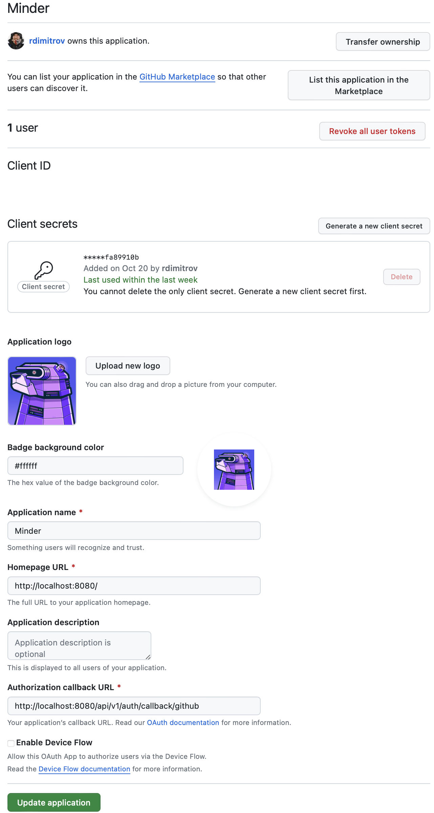

# Getting Started (Configuring a GitHub Provider)

Minder currently only supports GitHub as a provider. Later versions will support other providers.

Minder can either use GitHub OAuth2 application or GitHub App for authentication. This means that you will need to 
configure a GitHub OAuth 2.0 application or a GitHub App, to allow enrollment of users into Minder.

## Prerequisites

- [GitHub](https://github.com) account

## Create a GitHub App (option 1)

This approach allows users fine-grained control over the permissions that Minder has in their repositories. It also 
allows users to limit the repositories that Minder can access.

### Configure the GitHub App

1. Navigate to [GitHub Developer Settings](https://github.com/settings/profile)
1. Select "Developer Settings" from the left hand menu
1. Select "GitHub Apps" from the left hand menu
1. Select "New GitHub App"
1. Enter the following details:
   - GitHub App Name: `My Minder App` (or any other name you like)
   - Homepage URL: `http://localhost:8080`
   - Callback URL: `http://localhost:8080/api/v1/auth/callback/github-app/app`
   - Select the checkbox for "Request user authorization (OAuth) during installation"
1. Select the following permissions:
   - Repository Permissions:
     - Administration (read and write)
     - Contents (read and write)
     - Metadata (read only)
     - Packages (read and write)
     - Pull requests (read and write)
     - Repository security advisories (read and write)
     - Webhooks (read and write), Workflows (read and write)
   -  Organization Permissions:
     - Members (read only)
1. (optional) For the option "Where can this GitHub App be installed?", select "Any account" if you want to allow any GitHub user to install the app. Otherwise, select "Only on this account" to restrict the app to only your account.
1. Select "Create GitHub App"
1. Generate a client secret
1. Generate a private key 

### Set up `server-config.yaml`

The next step sets up Minder with the GitHub App you just created.

In your `server-config.yaml` file add the following section:
```yaml
github-app:
  client_id: <client-id>
  client_secret: <client-secret>
  redirect_uri: "http://localhost:8080/api/v1/auth/callback/github-app/app" # This needs to match the registered callback URL in the GitHub App
```
Replace `<client-id>` and `<client-secret>` with the client ID and secret of your GitHub App.

Then, add the following section to your `server-config.yaml` file:

```yaml
provider:
  github-app:
    app_name: <app-name>
    app_id: <app-id>
    user_id: <user-id>
    private_key: ".secrets/github-app.pem"
```

Replace `<app-name>` with the name of your app, which you can get by looking at the GitHub URL when editing your GitHub App. For example, if the URL is `https://github.com/settings/apps/my-test-app`, then your app name is `my-test-app`.
Replace `<app-id>` with the app ID of your GitHub App, which is found in the General -> About section of your GitHub App on GitHub.
Replace `<user-id>` with the result of running this command `curl https://api.github.com/users/<app-name>%5Bbot%5D | jq ".id"`, where `<app-name>` is the App name you used above.

Finally, ensure the private key is stored in the `.secrets` directory in the root of the Minder repository.

### Set up a fallback token for listing artifacts
When using a GitHub App installation token, GitHub does not allow listing artifacts. To work around this, you can create a personal access token, with the scopes `public_repo` and `read:packages` and add it to the `server-config.yaml` file:

```yaml
provider:
  github-app:
    fallback_token: <personal-access-token>
```
This token will be used to list artifacts in repositories.

### (optional) Configure the webhook
If you'd like Minder to automatically remove a provider when the GitHub App is uninstalled, you can configure a webhook in the GitHub App settings. The webhook can be configured to send events to `<your-domain>/api/v1/ghapp/`, where `<your-domain>` is the domain where Minder is running.

Note that if you're running Minder locally, you can use a service like [ngrok](https://ngrok.com/) to expose your local server to the internet.

## Create a GitHub OAuth Application (option 2)

Alternatively, you can use a GitHub OAuth application to allow users to enroll into Minder. There is no need to creat both a GitHub App and a GitHub OAuth application.

1. Navigate to [GitHub Developer Settings](https://github.com/settings/profile)
2. Select "Developer Settings" from the left hand menu
3. Select "OAuth Apps" from the left hand menu
4. Select "New OAuth App"
5. Enter the following details:
   - Application Name: `Minder` (or any other name you like)
   - Homepage URL: `http://localhost:8080`
   - Authorization callback URL: `http://localhost:8080/api/v1/auth/callback/github`
   - If you are prompted to enter a `Webhook URL`, deselect the `Active` option in the `Webhook` section.
6. Select "Register Application"
7. Generate a client secret
7. Copy the "Client ID" , "Client Secret" and "Authorization callback URL" values
   into your `./server-config.yaml` file, under the `github` section.

