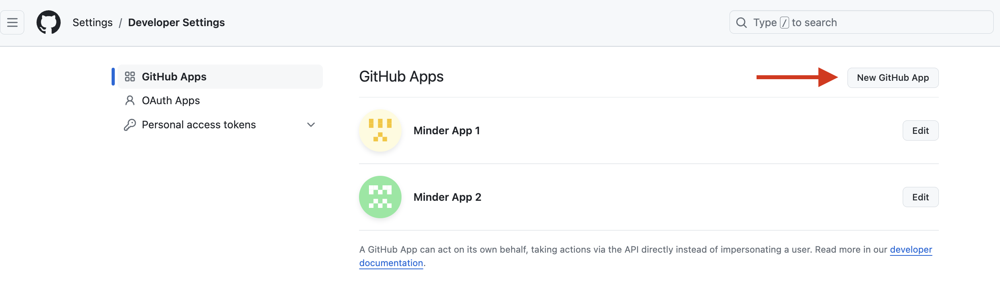

# Configuring a Provider
A provider connects Minder to your software supply chain — giving Minder information about your source code repositories, and their pull requests, dependencies, and artifacts.

The currently supported providers are:
- GitHub   

For GitHub, you configure a Provider by creating a GitHub App. 

## Prerequisites

- [GitHub](https://github.com) account

## Create a GitHub App
This approach allows fine-grained control over the permissions that Minder has in users' repositories.  It also 
allows users to limit the repositories that Minder can access.

1. Navigate to [GitHub Developer Settings](https://github.com/settings/profile)
1. Select "Developer Settings" from the left hand menu
1. Select "GitHub Apps" from the left hand menu
1. Select "New GitHub App"



### Basic Information
Complete the following fields:
   - GitHub App Name: `My Minder App` (or any other name you like)
   - Homepage URL: `http://localhost:8080`


### Identifying and authorizing users
Complete the following fields:
   - Callback URL: `http://localhost:8080/api/v1/auth/callback/github-app/app`
   - Add an additional Callback URL for Keycloak: `http://localhost:8081/realms/stacklok/broker/github/endpoint`
   - Select the checkbox for "Request user authorization (OAuth) during installation"


### Webhook
- Under Webhook, uncheck Active

### Permissions
Select the following permissions:
   - Repository Permissions:
     - Administration (read and write)
     - Contents (read and write)
     - Metadata (read only)
     - Packages (read and write)
     - Pull requests (read and write)
     - Repository security advisories (read and write)
     - Webhooks (read and write)
     - Workflows (read and write)

Once completed, double check your selected numbers match the ones in the screenshot.


### Installation and Scope
For the option "Where can this GitHub App be installed?":
- Select "Any account" if you want to allow any GitHub user to install the app
- Or, select "Only on this account" to restrict the app to only your account.

Then select "Create GitHub App" to create the App.


### Generate a client secret
You should now have a GitHub App created. You now need to create a `Client secret` for authentication.
Click the `Generate a new client secret button`.


Save the Client secret value for use in the Configure Minder step. 

### Generate a private key 
Scroll down to the bottom of the page and generate a private key.


This will generate and download your private key.
Now we need to move and rename the private key.
Run the following commands from the Minder root directory, replacing `<downloaded-file>` with the path to the downloaded private key.
```bash
mkdir .secrets
cp <downloaded-file> .secrets/github-app.pem
```

## Configure the Minder server
Now that we've created our GitHub App, we need to configure the Minder server to use it.


### Add GitHub App configuration

In your `server-config.yaml` file, located in the root Minder directory, find the following section:
```yaml
github-app:
  client_id: "client-id"
  client_secret: "client-secret"
  redirect_uri: "http://localhost:8080/api/v1/auth/callback/github-app/app" # This needs to match the registered callback URL in the GitHub App
```
Update the `client_id` and `client_secret` values with the following:
- Client ID : Found in the General -> About section of your GitHub App on GitHub.

- Client Secret : The value you saved previously. 

### Add Provider configuration
Then, find the following section in the same `server-config.yaml` file:

```yaml
provider:
  github-app:
    app_name: "app-name"
    app_id: 1234
    user_id: 1234
    private_key: ".secrets/github-app.pem"
```
Update the `app_name` with the name of your app, which you can get by looking at the GitHub URL when editing your GitHub App. For example, if the URL is https://github.com/settings/apps/my-test-app, then your app name is my-test-app.


Update `app_id` with the app ID of your GitHub App, which is found in the General -> About section of your GitHub App on GitHub.


Finally, you need the `user_id` value. To get the value, run the following command, where `<app-name>` is the App name you used above:

```bash
curl https://api.github.com/users/<app-name>%5Bbot%5D
```
Update the `user_id` value with the `id` value returned from that command. 


Now save the file. Your Provider is now created and the Minder server is configured to use it.


