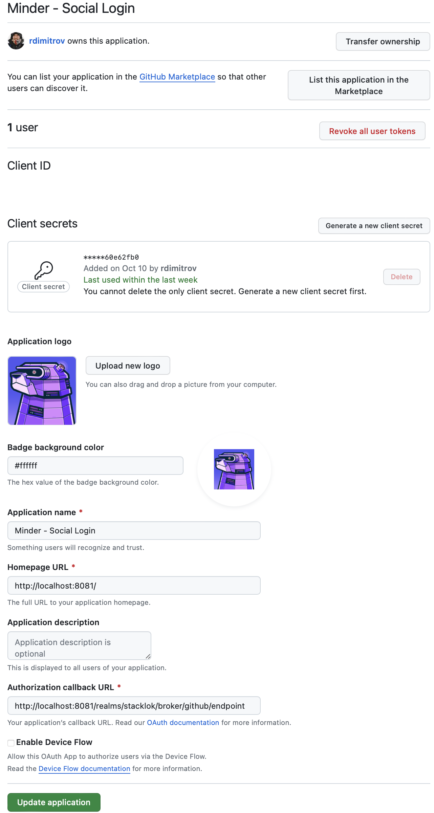

# Run a minder server

Minder is platform, comprising of a controlplane, a CLI, a database and an identity provider.

The control plane runs two endpoints, a gRPC endpoint and a HTTP endpoint.

Minder is controlled and managed via the CLI application `minder`.

PostgreSQL is used as the database.

Keycloak is used as the identity provider.

There are two methods to get started with Minder, either by downloading the
latest release, building from source or (quickest) using the provided `docker-compose.yaml`
file.

## Prerequisites

- [Go 1.20](https://golang.org/doc/install)
- [PostgreSQL](https://www.postgresql.org/download/)
- [Keycloak](https://www.keycloak.org/guides)

## Download the latest release

[stub for when we cut a first release]

## Build from source

Alternatively, you can build from source.

### Clone the repository

```bash
git clone git@github.com:stacklok/minder.git
```

### Build the application

```bash
make build
```

This will create two binaries, `bin/minder-server` and `bin/minder`.

You may now copy these into a location on your path, or run them directly from the `bin` directory.

You will also need a configuration file. You can copy the example configuration file from `configs/server-config.yaml.example` to `$(PWD)/server-config.yaml`.

If you prefer to use a different file name or location, you can specify this using the `--config` 
flag, e.g. `minder-server --config /file/path/server-config.yaml serve` when you later run the application.

## Database creation

Minder requires a PostgreSQL database to be running. You can install this locally, or use a container.

Should you install locally, you will need to set certain configuration options in your `server-config.yaml` file, to reflect your local database configuration.

```yaml
database:
  dbhost: "localhost"
  dbport: 5432
  dbuser: postgres
  dbpass: postgres
  dbname: minder
  sslmode: disable
```

### Using a container

A simple way to get started is to use the provided `docker-compose.yaml` file.

```bash
docker compose up -d postgres
```

### Create the database

Once you have a running database, you can create the database using the `minder-server` CLI tool or via the `make` command.

```bash
make migrateup
```

or:

```bash
minder-server migrate up
```

## Identity Provider
Minder requires a Keycloak instance to be running. You can install this locally, or use a container.

Should you install locally, you will need to configure the client on Keycloak.
You will need the following:
- A Keycloak realm named "stacklok" with event saving turned on for the "Delete account" event.
- A registered public client with the redirect URI `http://localhost/*`. This is used for the minder CLI.
- A registered confidential client with a service account that can manage users and view events. This is used for the minder server.

You will also need to set certain configuration options in your `server-config.yaml` file, to reflect your local Keycloak configuration.
```yaml
identity:
  server:
    issuer_url: http://localhost:8081
    client_id: minder-server
    client_secret: secret
```

Similarly, for the CLI `config.yaml`.
```yaml
identity:
  cli:
    issuer_url: http://localhost:8081
    client_id: minder-cli
```

### Using a container

A simple way to get started is to use the provided `docker-compose.yaml` file.

```bash
docker compose up -d keycloak
```

### Social login
Once you have a Keycloak instance running locally, you can set up GitHub authentication.

#### Create a GitHub OAuth Application for Social Login

1. Navigate to [GitHub Developer Settings](https://github.com/settings/profile)
2. Select "Developer Settings" from the left hand menu
3. Select "OAuth Apps" from the left hand menu
4. Select "New OAuth App"
5. Enter the following details:
    - Application Name: `Stacklok Identity Provider` (or any other name you like)
    - Homepage URL: `http://localhost:8081` or the URL you specified as the `issuer_url` in your `server-config.yaml`
    - Authorization callback URL: `http://localhost:8081/realms/stacklok/broker/github/endpoint`
6. Select "Register Application"
7. Generate a client secret



#### Enable GitHub login

Using the client ID and client secret you created above, enable GitHub login your local Keycloak instance by running the 
following command:
```bash
make KC_GITHUB_CLIENT_ID=<client_id> KC_GITHUB_CLIENT_SECRET=<client_secret> github-login
```

## OpenFGA
Minder requires a OpenFGA instance to be running. You can install this locally, or use a container.

Should you install locally, you will need to set certain configuration options in your `server-config.yaml` file, to reflect your local OpenFGA configuration.
```yaml
authz:
   api_url: http://localhost:8082
   store_name: minder
   auth:
      # Set to token for production
      method: none
```

### Using a container

A simple way to get started is to use the provided `docker-compose.yaml` file.

```bash
docker compose up -d openfga
```

### Create the model

Once you have a running OpenFGA instance, you can create the model using the `minder-server` CLI tool or via the `make` command.

```bash
make migrateup
```

or:

```bash
minder-server migrate up
```

## Create token key passphrase

Create a token key passphrase that is used when storing the provider's token in the database. 

The default configuration expects these keys to be in a directory named `.ssh`, relative to where you run the `minder-server` binary.
Start by creating the `.ssh` directory.

```bash
mkdir .ssh
```

You can create the passphrase using the `openssl` CLI tool.

```bash
openssl rand -base64 32 > .ssh/token_key_passphrase
```

If your key lives in a directory other than `.ssh`, you can specify the location of the key in the `server-config.yaml` file.

```yaml
auth:
   token_key: "./.ssh/token_key_passphrase"
```

## Configure the Repository Provider

At this point, you should have the following:

- A running PostgreSQL database, with the `minder` database created
- A running Keycloak instance
- A GitHub OAuth application configured for social login using Keycloak

**Prior to running the application**, you need to configure your repository provider. Currently, Minder only supports GitHub.
See [Configure Repository Provider](./config_oauth.md) for more information.

## Updating the Webhook Configuration

Minder requires a webhook to be configured on the repository provider. Currently, Minder only supports GitHub. 
The webhook allows GitHub to notify Minder when certain events occur in your repositories.
To configure the webhook, Minder needs to be accessible from the internet. If you are running the server locally, you 
can use a service like [ngrok](https://ngrok.com/) to expose your local server to the internet.

Here are the steps to configure the webhook:

1. **Expose your local server:** If you are running the server locally, start ngrok or a similar service to expose your 
local server to the internet. Note down the URL provided by ngrok (it will look something like `https://<random-hash>.ngrok.io`).
Make sure to expose the port that Minder is running on (by default, this is port `8080`).

2. **Update the Minder configuration:** Open your `server-config.yaml` file and update the `webhook-config` section with 
the ngrok URL Minder is running on. The `external_webhook_url` should point to the `/api/v1/webhook/github`
endpoint on your Minder server, and the `external_ping_url` should point to the `/api/v1/health` endpoint. The `webhook_secret`
should match the secret configured in the GitHub webhook (under `github.payload_secret`).

```yaml
webhook-config:
    external_webhook_url: "https://<ngrok-url>/api/v1/webhook/github"
    external_ping_url: "https://<ngrok-url>/api/v1/health"
    webhook_secret: "your-password" # Should match the secret configured in the GitHub webhook (github.payload_secret)
```

After these steps, your Minder server should be ready to receive webhook events from GitHub, and add webhooks to repositories.

In order to rotate webhook secrets, you can use the `minder-server` CLI tool to update the webhook secret.

```bash
minder-server webhook update -p github
```

Note that the command simply replaces the webhook secret on the provider
side. You will need to update the webhook secret in the server configuration
to match the provider's secret.

## Run the application

```bash
minder-server serve
```

If the application is configured using `docker compose`, you need to modify the `server-config.yaml` file to reflect the database host url.

```yaml
database:
  dbhost: "postgres" # Changed from localhost to postgres
  dbport: 5432
  dbuser: postgres
  dbpass: postgres
  dbname: minder
  sslmode: disable
```

After configuring `server-config.yaml`, you can run the application using `docker compose`.

```bash
docker compose up -d minder
```

The application will be available on `http://localhost:8080` and gRPC on `localhost:8090`.