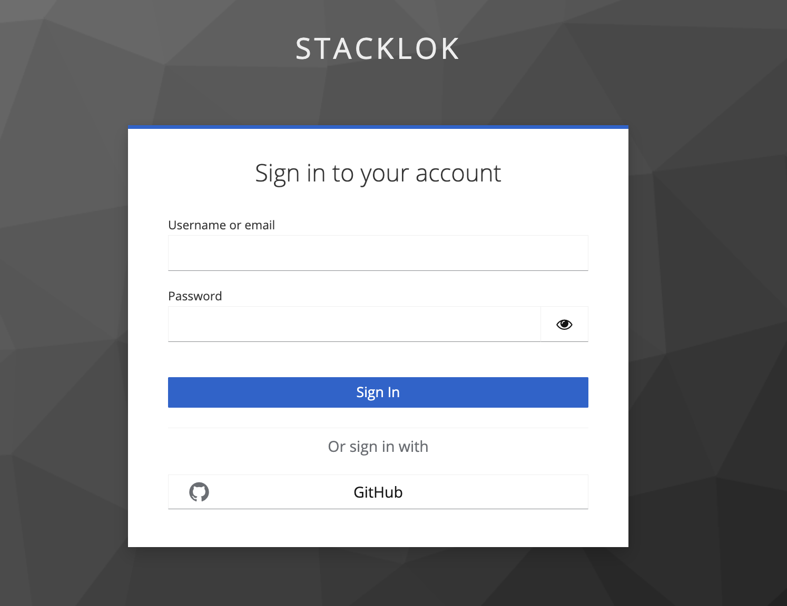
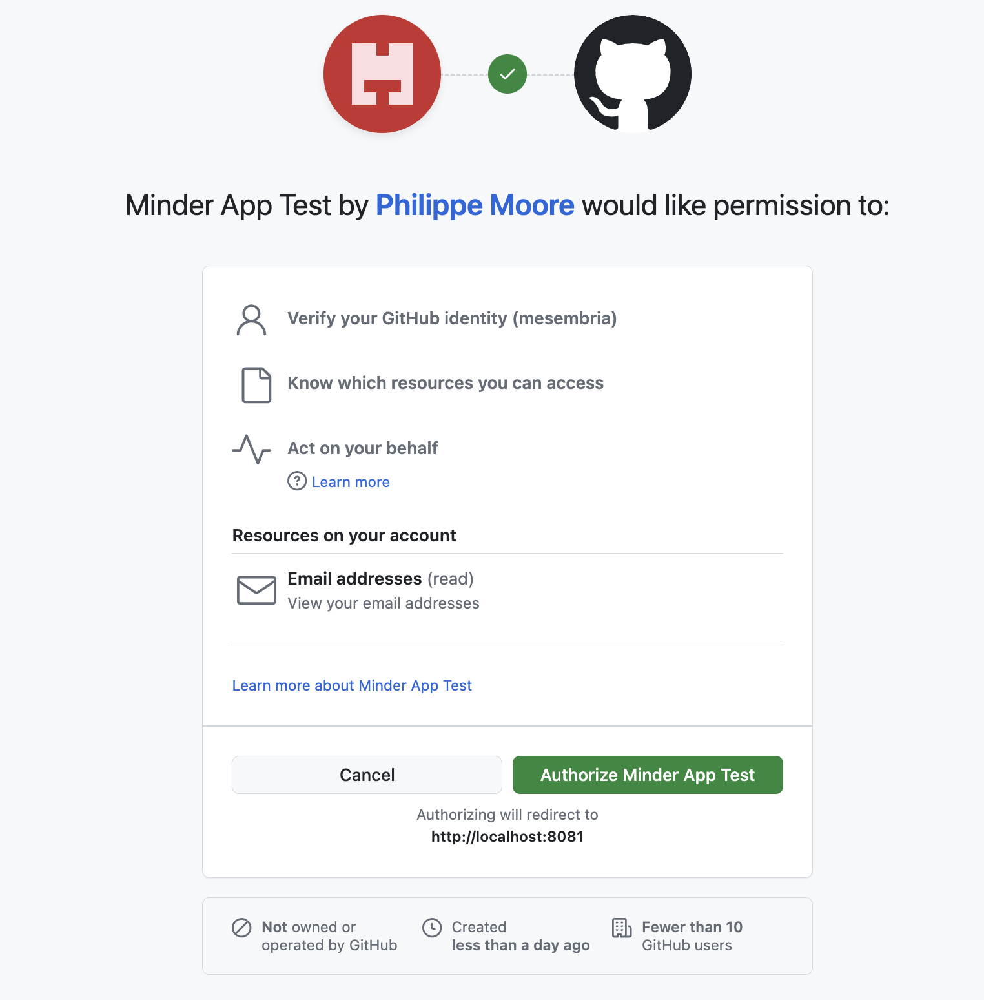
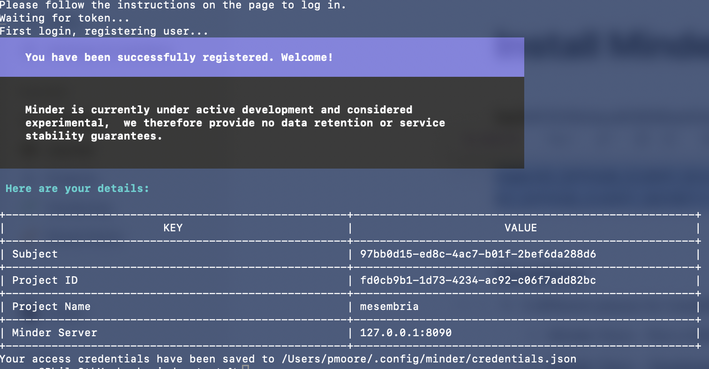

# Installing a Development version 

This guide shows you how to run a Minder server locally. It is intended for users who would like to contribute to the Minder project. It is not intended for production use. 
This guide will walk you through how to: 
- Retrieve the latest source code
- Set up your development environment
- Run the dependent applications
- Create a Provider
- Set up authentication

Once you complete this guide, you will have a Minder server built from source and ready to contribute to.

## Prerequisites

- [Go 1.22](https://golang.org/doc/install)
- [Docker](https://docs.docker.com/get-docker/)
- [Docker Compose](https://docs.docker.com/compose/install/)
- [ko](https://ko.build/install/)
- [yq](https://github.com/mikefarah/yq)


## Steps

### Clone the repository
Begin by cloning the Minder repository to get the latest source code. 

```bash
git clone git@github.com:stacklok/minder.git
cd minder
```

### Set up Development Environment
To set up your development environment, run:

```bash
make bootstrap
```
This will install the required tools for running different make targets, initialize required configuration files, as well as generate a token key passphrase.

### Build the application
Run the following to build minder and minder-server (binaries will be present at ./bin/)
```bash
make build
```

You may copy these into a location on your path, or run them directly from the `bin` directory.


### Configure the Repository Provider
You now need to create a Provider to enable Minder to inspect and manage your repository configuration. Currently only GitHub is supported as a Provider, so we'll do this using a GitHub App. This app will also provide Keycloak with an authentication source. Follow the steps in [Configuring a Provider](./config_provider.md) then return here to complete configuring the server. Be sure to save the Client ID and Client secret values, because you will need them again below. 


### Start the Minder server
At this point, you should have a GitHub provider configured and your `server-config.yaml` file updated. 
Start `minder-server` along with its dependent services (`keycloak` and `postgres`) by running:

```bash
make run-docker
```
As this command runs, you will see it build the Minder server container and then start the dependent containers.
If you run
```bash
docker ps
```
you should see 4 new services running:
- keycloak
- minder
- openfga
- postgres


### Configure Keycloak
Now that the Keycloak application is running, you need to configure it using the GitHub App you previously configured. 
To enable GitHub login on Keycloak run the following command, using the `client_id` and `client_secret` you generated setting up the GitHub app: 

```bash
make KC_GITHUB_CLIENT_ID=<client_id> KC_GITHUB_CLIENT_SECRET=<client_secret> github-login
```

You should see it create a new instance and new mappers. You may see a resource not found message. This is safe to ignore. 


### Authenticate minder 
At this point, you should have the following:

- A PostgreSQL database and Keycloak and OpenFGA instances running in containers
- A minder-server built from source running in a container 
- A GitHub application configured to provide access to a set of repositories

The final step is to authenticate the `minder` application using Keycloak and the GitHub application that was previous configured. 
To do this run:
```bash
minder auth login
```

This will open Keycloak login window in your browser.


Click GitHub to sign in. This should display a GitHub authorization window asking if you'd like to give permission to your Minder server. 


Click Authorize. The browser window should say Authentication Successful and the command line should say you've been successfully registered. 



Congratulations! You've set up a Minder server! Now you're all ready to contribute to Minder.

For more information about the development process, please see the [Developer Guide](https://minder-docs.stacklok.dev/developer_guide/get-hacking).

For more information on contributing, please see our [Contributing Guide](https://github.com/stacklok/minder/blob/main/CONTRIBUTING.md).

A list of good first issues can be found in the [Minder GitHub project](https://github.com/stacklok/minder/issues?q=is%3Aissue%20state%3Aopen%20label%3A%22good%20first%20issue%22).


## Optional Steps

### Setting up a Webhook
With the basic setup, GitHub is unable to notify Minder when certain events occur in your repositories. MORE DETAILS WOULD BE NICE. Configuring a Webhook will allow GitHub to communicate back to the Minder instance. Details on how to set this up can be found in the [Configuring a Webhook](./config_webhook.md) guide. 

### Running Minder server directly
There are certain situations where you might want to run the Minder server directly, instead of as a container. 
These steps will allow you to do that. They assume you have completed the basic setup. 

#### Stop the Minder server container
Stop the Minder server, while leaving the dependant containers to continue running. 
```bash
docker stop minder_server
```

#### Configuration Changes
Find the authz section in your `server-config.yaml` file located in your root Minder directory. Update the `api_url` to point to `http://localhost:8082`.

```yaml
authz:
  api_url: http://localhost:8082 
  store_name: minder
  auth:
    # Set to token for production
    method: none
```

#### Run the server
Start the server from the command line using the following command:
```bash
go run cmd/server/main.go serve
```
You should see the server start up and then a series of log messages. You are now running the Minder server directly.
